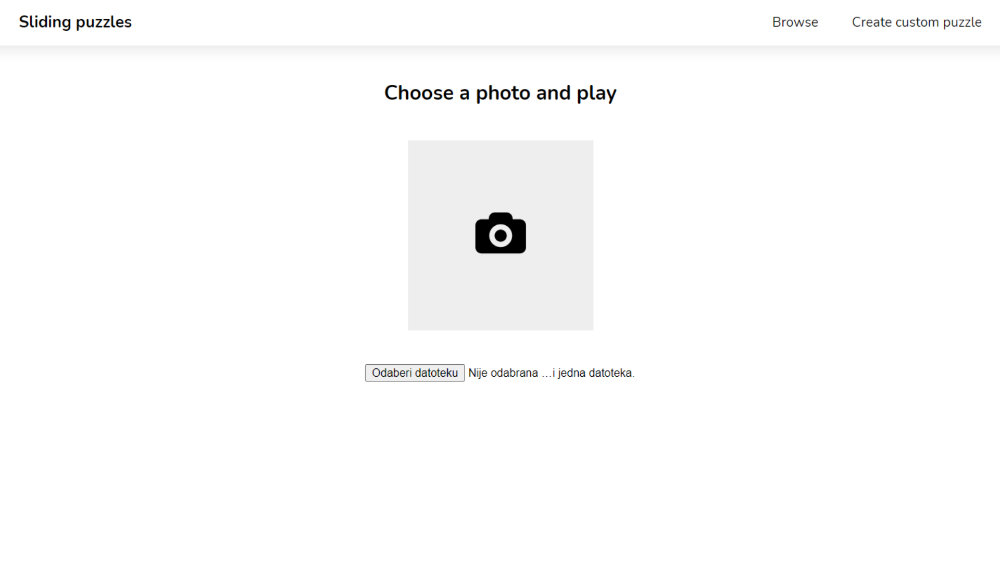
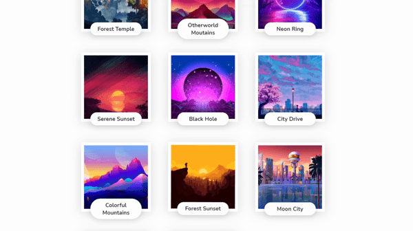

# Sliding Puzzles

Play sliding puzzles in three difficulties using a searchable gallery of provided images or upload a custom image.

The app is hosted on GitHub Pages here:
[Play Sliding Puzzles](https://dashnothing.github.io/sliding-puzzle "Play Sliding Puzzles")

---

## Installation

Clone the project from `https://github.com/DashNothing/sliding-puzzle.git`

## Usage

Run `npm start` to run the application locally.

---

## Features

**Browse and search provided puzzles**

**Upload custom puzzles**

**Play in one of three difficulties**

**Simple controls with animated feedback**

---

&copy; Toni Stokić 2021
